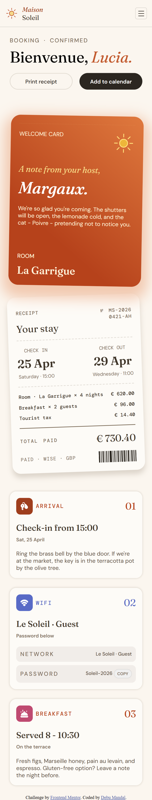
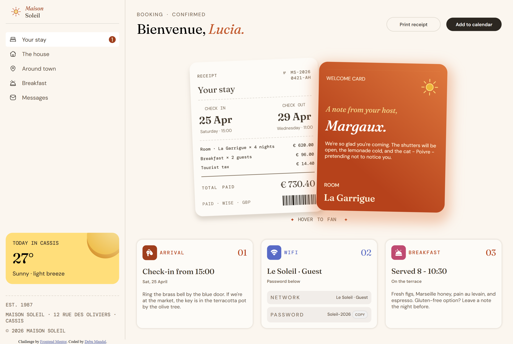
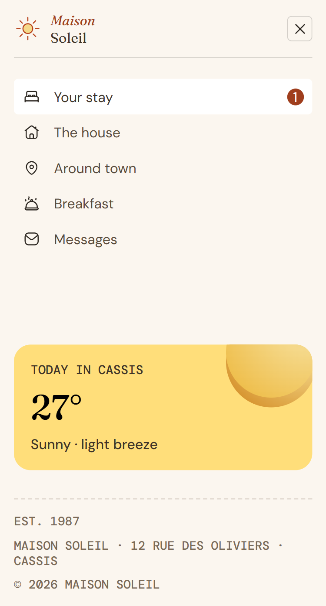

# Frontend Mentor - Hotel Booking Confirmation Page Solution

This is my solution to the [Hotel Booking Confirmation Page challenge](https://www.frontendmentor.io/challenges/hotel-booking-confirmation-page) from Frontend Mentor.

## Table of Contents

- [Overview](#overview)
  - [The Challenge](#the-challenge)
  - [Screenshots](#screenshots)
  - [Links](#links)
- [My Process](#my-process)
  - [Built With](#built-with)
  - [Problems Faced & Solutions](#problems-faced--solutions)
  - [Continued Development](#continued-development)
- [Author](#author)

## Overview

### The Challenge

Users should be able to:

- View the optimal layout for the interface depending on their device's screen size
- See hover and focus states for all interactive elements on the page
- Open and close the navigation menu on smaller screens (optional JavaScript)
- Copy the Wi-Fi password to their clipboard using the copy button (optional JavaScript)

### Screenshots

#### Mobile Design

#### Desktop Design

#### Active States

### Links

- Solution URL: https://www.frontendmentor.io/solutions/responsive-hotel-booking-page-using-css-grid-and-flexbox-bNehY8x_Yq

- Live Site URL: https://debumandal.github.io/hotel-booking-confirmation-page/

## My Process

### Built With

- Semantic HTML5
- CSS Custom Properties
- CSS Flexbox
- CSS Grid
- Mobile-first workflow
- Vanilla JavaScript
- DOM manipulation for the mobile menu

### Problems Faced & Solutions

#### 1. Creating the Overlapping Cards

**Problem:**  
I needed to overlap the receipt card with the host card without breaking the layout on different screen sizes.

**Solution:**  
Instead of using `position: absolute`, I kept both cards in the normal document flow and used negative margins, `z-index`, and `transform: rotate()` to create the overlapping effect.

#### 2. Positioning the Sun Illustration

**Problem:**  
The sun illustration was pushing the cards apart because it was part of the layout.

**Solution:**  
I used `position: relative` on the parent and `position: absolute` on the sun illustration. This placed it behind the cards without affecting their layout.

#### 3. Creating the Card Fanning Animation

**Problem:**  
I needed both cards to move in different directions when the user hovered over them.

**Solution:**  
I used CSS `transition`, `translateX()`, and `rotate()` to move the cards smoothly in opposite directions and reveal the sun illustration.

#### 4. Keeping the Focus State from Moving the Layout

**Problem:**  
Adding padding to the navigation links during `:focus-visible` caused the layout to shift.

**Solution:**  
I removed the extra padding and used `outline-offset` instead. This created a visible focus ring without changing the element's size.

## Continued Development

This project helped me practice responsive layouts, CSS positioning, animations, and basic JavaScript DOM manipulation.

My next focus is JavaScript. I plan to build more interactive projects and learn how to work with APIs and dynamic data.

## Author

- Frontend Mentor - [@DebuMandal](https://www.frontendmentor.io/profile/debumandal)

- LinkedIn - [@DebuMandal](https://www.linkedin.com/in/debumandal-dev/)

- Github - [@DebuMandal] (https://github.com/debumandal)
